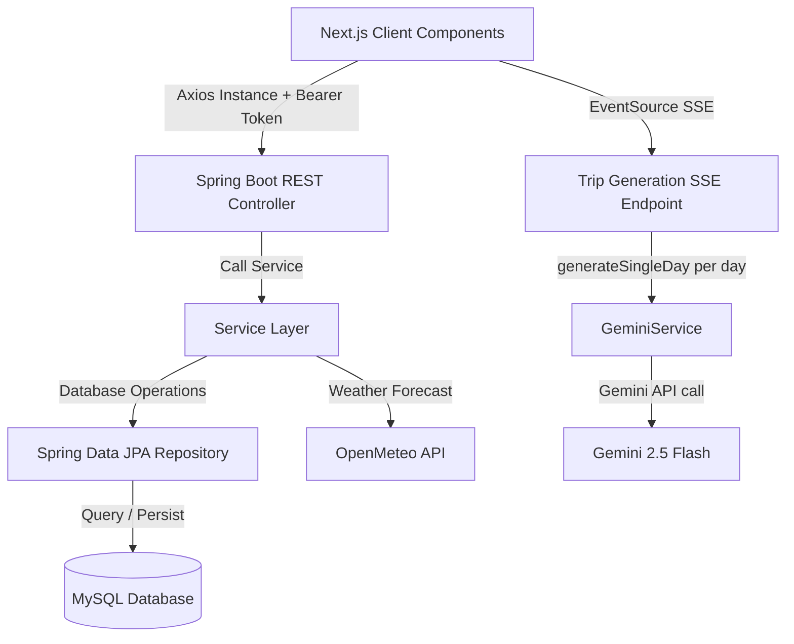

# Quy tắc & Quy chuẩn dự án VoyAI (AI Smart Travel Planner)

Tài liệu này được biên soạn bởi **Senior Developer**, đóng vai trò là bộ quy chuẩn (Guidelines) bắt buộc áp dụng cho toàn bộ quá trình phát triển dự án VoyAI (bao gồm cả Backend Spring Boot và Frontend Next.js). Tất cả thành viên dự án và AI coding assistant cần tuân thủ nghiêm ngặt các quy tắc dưới đây.

---

## 1. Tổng quan dự án (Project Overview)
*   **Tên dự án:** VoyAI / AI Smart Travel Planner.
*   **Mục tiêu:** Xây dựng nền tảng hỗ trợ người dùng lên lịch trình du lịch thông minh. Ứng dụng tích hợp Trí tuệ nhân tạo (Generative AI - Gemini) để tự động hóa việc thiết kế lịch trình chi tiết (từng ngày, các hoạt động, thời gian biểu, dự trù ngân sách và thông tin thời tiết) theo nhu cầu cá nhân hóa (điểm khởi hành, điểm đến, số ngày, ngân sách, ghi chú đặc biệt).
*   **Công nghệ cốt lõi:**
    *   **Backend:** Java 17+, Spring Boot 3.x, Spring Data JPA, Spring Security (JWT & Google OAuth2), Lombok, Gradle.
    *   **Frontend:** Next.js 14 (App Router), React 18, TypeScript, Tailwind CSS v4, Zustand (quản lý state), Axios (HTTP Client), Leaflet & React-Leaflet (bản đồ), `@hello-pangea/dnd` (xử lý kéo thả lịch trình).
    *   **Dịch vụ tích hợp ngoại vi:** Gemini API (AI generation), Open-Meteo API (thông tin & dự báo thời tiết), OpenStreetMap/Nominatim API (tìm kiếm & định vị tọa độ).
*   **Lưu ý bắt buộc cho AI Coding Assistant:**
    *   Trước khi sinh code mới hoặc sửa code cũ, LUÔN đọc các file liên quan đã tồn tại trong `entity/`, `dto/`, `src/types/index.ts` để tái sử dụng đúng field/type đã có, tránh tạo trùng lặp hoặc đặt tên lệch nhau giữa Backend và Frontend.
    *   Nếu một thay đổi ở Backend (thêm/sửa/xóa field trong Entity hoặc DTO) có khả năng ảnh hưởng tới Frontend, PHẢI cập nhật đồng bộ tương ứng trong `src/types/index.ts`. Không để hai bên lệch kiểu dữ liệu.
    *   Khi không chắc chắn về một quyết định kiến trúc (ví dụ: đặt logic ở Controller hay Service, tạo DTO mới hay tái dùng DTO cũ), ưu tiên phương án tuân thủ chặt mục 4 (Architecture Patterns) hơn là phương án nhanh nhất.

---

## 2. Cấu trúc dự án (Project Structure)

### 2.1. Backend (Spring Boot) - `VoyAI_AITravelPlanner`
Cấu trúc thư mục mã nguồn chính nằm tại: `src/main/java/com/codegym/voyai`

```
com.codegym.voyai/
├── config/
│   ├── security/               ← Toàn bộ thành phần bảo mật
│   │   ├── JwtService.java
│   │   ├── JwtResponse.java
│   │   ├── JwtAuthenticationTokenFilter.java
│   │   ├── CustomAccessDeniedHandler.java
│   │   └── RestAuthenticationEntryPoint.java
│   ├── SecurityConfig.java
│   ├── PasswordEncoderConfig.java
│   └── DataSeeder.java
│
├── controller/                 ← REST Controllers (mỏng, không có nghiệp vụ)
│
├── entity/                     ← JPA Entities duy nhất (không chứa DTO)
│   ├── Activity.java
│   ├── BudgetEntry.java
│   ├── DestinationCost.java
│   ├── RefreshToken.java
│   ├── Role.java
│   ├── Trip.java
│   ├── TripDay.java
│   ├── User.java
│   ├── UserPrinciple.java
│   └── WeatherCache.java
│
├── dto/                        ← Toàn bộ DTO, tách rõ theo mục đích
│   ├── request/                ← Input từ Client
│   │   ├── LoginRequest.java
│   │   ├── RegisterRequest.java
│   │   ├── TripRequest.java
│   │   ├── ActivityUpdateRequest.java
│   │   ├── ReorderRequest.java
│   │   ├── BudgetEntryRequest.java
│   │   ├── GoogleAuthRequest.java
│   │   └── UserContributionRequest.java
│   ├── response/               ← Output trả về Client
│   │   ├── AuthResponse.java
│   │   ├── UserDTO.java
│   │   └── DestinationCostDTO.java
│   └── external/               ← DTO map từ API bên ngoài (Gemini, Weather...)
│       ├── gemini/
│       │   ├── GeminiRequest.java
│       │   └── GeminiResponse.java
│       ├── travel/
│       │   └── TravelItinerary.java
│       └── weather/
│           ├── DailyWeatherDTO.java
│           └── OpenMeteoResponse.java
│
├── repository/                 ← Spring Data JPA Interfaces
│
├── service/                    ← Business Logic
│   ├── DestinationCostService.java
│   ├── GeminiService.java
│   ├── NominatimService.java
│   ├── RoleService.java
│   ├── TripService.java
│   ├── UserService.java
│   └── WeatherService.java
│
└── exception/                  ← Custom exceptions & GlobalExceptionHandler
```

**Quy tắc tạo file mới (Backend):**
*   Entity mới → đặt trong `entity/`, đặt tên danh từ số ít, không hậu tố (ví dụ: `Trip`, không phải `TripEntity`). **Không đặt entity trong `dto/` hoặc bất kỳ folder nào khác.**
*   DTO input từ Client → đặt trong `dto/request/`, hậu tố `Request` (ví dụ: `ActivityCreateRequest`).
*   DTO output trả về Client → đặt trong `dto/response/`, hậu tố `Response` hoặc `DTO` (ví dụ: `TripSummaryResponse`).
*   DTO map từ API ngoài (Gemini, OpenMeteo...) → đặt trong `dto/external/` theo sub-folder tương ứng. Không trộn lẫn với DTO request/response của nghiệp vụ nội bộ.
*   Security handler/filter → đặt trong `config/security/`, không đặt trong `entity/` hoặc `dto/`.
*   Exception nghiệp vụ mới → đặt trong `exception/`, kế thừa từ `RuntimeException`.
*   Không tạo 1 DTO dùng chung cho nhiều mục đích khác nhau. Không đặt DTO và Entity lẫn lộn cùng một folder.
*   Trước khi tạo Entity/DTO mới, kiểm tra xem đã có Entity/DTO tương tự chưa để tránh trùng lặp.
*   **Import package:** Khi tham chiếu Entity, import từ `com.codegym.voyai.entity.*`. Khi tham chiếu DTO, import từ `com.codegym.voyai.dto.request.*`, `com.codegym.voyai.dto.response.*`, hoặc `com.codegym.voyai.dto.external.*` theo đúng sub-package.

### 2.2. Frontend (Next.js) - `AI-smart-travel-planner`
*   `app/`: Cấu trúc định tuyến (Next.js App Router).
    *   `/trips/`: Danh sách các chuyến đi.
    *   `/trips/[id]/`: Giao diện tương tác chi tiết lịch trình chuyến đi.
    *   `/login/`: Trang đăng nhập/đăng ký tích hợp Modal.
    *   `globals.css`: Thiết lập CSS toàn cục và biến cấu hình Tailwind v4.
    *   `layout.tsx`: Layout tổng thể của ứng dụng.
*   `components/`: Chứa các component giao diện chia theo module:
    *   `auth/`: Component xác thực (`login-form.tsx`, `register-form.tsx`, `profile-modal.tsx`...).
    *   `home/`: Component trang chủ (`travel-form.tsx`, `hero-slider.tsx`, `generating-overlay.tsx`, `seasonal-destination-suggestions.tsx`...).
    *   `trip-details/`: Các Widget tương tác ở trang chi tiết (`ItineraryBoard.tsx`, `BudgetWidget.tsx`, `TripMap.tsx`, `WeatherWidget.tsx`, `TimelineWidget.tsx`...).
    *   `ui/`: Các component giao diện dùng chung, KHÔNG chứa business logic (Button, Dialog, Input...).
*   `src/`:
    *   `lib/`: Các cấu hình tiện ích (Axios Instance cấu hình Authorization interceptors).
    *   `services/`: Các API Service gọi lên Backend (`trip.service.ts`, `activity.service.ts`, `auth.service.ts`...).
    *   `store/`: Zustand global stores (`authStore.ts`).
    *   `types/`: Các TypeScript Interface (`index.ts`) được đồng bộ chặt chẽ với DTO & Entity của Backend.

**Quy tắc tạo file mới (Frontend):**
*   Component thuộc về 1 module nghiệp vụ cụ thể (trip-details, home, auth) PHẢI đặt trong thư mục con tương ứng. Không đặt lẫn vào `ui/`.
*   Component được đưa vào `ui/` chỉ khi nó hoàn toàn tái sử dụng được, không phụ thuộc vào nghiệp vụ Trip/Activity/Budget cụ thể nào.
*   Mỗi Service mới trong `src/services/` chỉ chịu trách nhiệm cho 1 Entity/nghiệp vụ duy nhất.
*   Trước khi tạo component mới, kiểm tra `components/ui/` xem đã có sẵn building block phù hợp chưa để tái sử dụng.

---

## 3. Tiêu chuẩn & Quy ước Code (Coding Conventions & Standards)

### 3.1. Quy ước Backend (Java/Spring Boot)
*   **Quy tắc đặt tên Repository:** Bắt buộc bắt đầu bằng chữ `I` viết hoa và kết thúc bằng `Repository` (ví dụ: `ITripRepository`, `IActivityRepository`).
*   **Sử dụng Lombok hiệu quả:**
    *   Sử dụng `@Data`, `@NoArgsConstructor`, `@AllArgsConstructor`, `@Builder` cho Entity và DTO.
    *   Đối với quan hệ hai chiều (OneToMany/ManyToOne), luôn thêm `@ToString.Exclude` và `@EqualsAndHashCode.Exclude` để tránh Infinite Loop.
*   **Dependency Injection:** Ưu tiên Constructor Injection qua `@RequiredArgsConstructor` thay vì `@Autowired` lên thuộc tính.
*   **Xử lý ngày giờ:** Dùng Java 8 API (`LocalDate`, `LocalTime`, `LocalDateTime`). Không dùng `Date` cũ. Định dạng thời gian từ Client: `"HH:mm"` hoặc `"HH:mm:ss"`.
*   **Quản lý Transaction:** Đánh dấu `@Transactional` ở tầng Service cho các tác vụ thay đổi dữ liệu hoặc cập nhật hàng loạt.
*   **Validation đầu vào:** Bắt buộc dùng Jakarta Validation annotation trên DTO, kết hợp `@Valid` tại Controller. Không viết validate thủ công trong Service nếu annotation đáp ứng được.
*   **Xử lý Exception tập trung:** Toàn bộ exception xử lý tại `GlobalExceptionHandler` (`@RestControllerAdvice`) trong `exception/`. Không dùng try-catch rải rác trong Controller.
*   **Naming method ở Service:** Convention `createX`, `getXById`, `getAllXByY`, `updateX`, `deleteX`.

### 3.2. Quy ước Frontend (Next.js/React/TypeScript)
*   **Kiểu dữ liệu nghiêm ngặt:** Không dùng `any`. Dùng alias type trong `src/types/index.ts` (`JavaLong`, `JavaBigDecimal`, `JavaLocalDate`...).
*   **Quản lý State:** Zustand cho Global State. `useState`/`useRef` cho Local State trong 1 Component.
*   **Quy ước Component:**
    *   Phân định rõ `"use client"` cho component cần tương tác (Forms, Drag & Drop, Map, SSE) và Server Component cho cấu trúc tĩnh.
    *   Tách biệt logic gọi API vào `src/services`, component chỉ gọi service và xử lý hiển thị.
*   **Quy tắc đặt tên:**
    *   Tên file component: `kebab-case.tsx`.
    *   Tên function/component: `PascalCase`.
    *   Tên hàm trong Service/Store: `camelCase`, động từ rõ nghĩa (`fetchTripById`, `updateActivityOrder`).
*   **Quy ước gọi API:**
    *   Dùng **Axios thuần + `useState`/`useEffect`** (không dùng React Query/SWR). Pattern: `useState` riêng cho `data`, `loading`, `error`; cleanup function (cờ `isMounted` hoặc `AbortController`) trong `useEffect`.
    *   **SSE:** Dùng `EventSource` native (không dùng Axios) cho SSE endpoint. Luôn đóng `EventSource` trong cleanup của `useEffect` hoặc khi nhận event `complete`/lỗi nghiêm trọng.
    *   Lỗi Axios chuẩn hóa tại `services/`, ném lại dưới dạng `Error` với message đã xử lý. Component không đọc `error.response.data` trực tiếp.
    *   Không gọi `axios` trực tiếp trong component hoặc `page.tsx` — luôn đi qua `src/services/`.
*   **Styling:** Dùng Tailwind utility classes. Dùng helper `cn` (clsx + tailwind-merge) khi ghép class động.

---

## 4. Mô hình kiến trúc (Architecture Patterns)



### 4.0. Nguyên tắc chung: "Controller mỏng, Service dày"
*   Controller chỉ làm 3 việc: nhận request → gọi đúng 1 method Service → trả `ResponseEntity`. Không có if/else nghiệp vụ, không tính toán, không gọi trực tiếp Repository/API bên thứ ba.
*   Toàn bộ nghiệp vụ nằm ở tầng Service.

### 4.1. Tầng Controller
*   Tiếp nhận Request, validate cơ bản qua Spring Validation, điều hướng qua Service, trả Response.
*   Không viết logic nghiệp vụ trong Controller.

### 4.2. Tầng Service
*   Chứa toàn bộ Business Logic. Giao tiếp API bên thứ ba qua Service chuyên biệt (`GeminiService`, `WeatherService`, `NominatimService`).
*   Trả về Entity thuần hoặc DTO sạch cho Controller, không trả raw response bên thứ ba.

### 4.3. Tầng Repository & Database
*   Dùng Spring Data JPA. Ưu tiên JPQL hoặc method tạo sẵn của Spring Data. Hạn chế Native Query.

### 4.4. Optimistic Update (Drag-and-Drop Reorder)
*   Cập nhật UI ngay lập tức khi thả → gọi API ngầm → rollback nếu API lỗi.

### 4.5. Progressive Generation (AI Itinerary - SSE)
*   Backend gọi Gemini **N lần tuần tự** (1 request = 1 ngày). Không gọi đồng thời.
*   Sau mỗi ngày xong: lưu DB ngay → emit SSE event `day-ready`.
*   Lỗi 1 ngày → emit `day-error` → tiếp tục các ngày còn lại (không dừng batch).
*   Context chống trùng: mỗi request ngày N nhận `usedPlaceNames` từ các ngày trước (chỉ tên, giới hạn 2 ngày gần nhất nếu N > 5).
*   Frontend dùng `EventSource`, render `DayCard` ngay khi nhận `day-ready`, skeleton cho `loadingDay`, nút retry cho ngày lỗi.

---

## 5. Phong cách phản hồi (Response Style)

### 5.1. Phản hồi API (Backend)
*   API REST thông thường trả về JSON đồng bộ.
*   SSE endpoint (`text/event-stream`) trả về stream event: `event: <tên>\ndata: <JSON>\n\n`. Event types: `day-ready`, `day-error`, `complete`.
*   HTTP Status Codes chuẩn: `200 OK`, `201 Created`, `400 Bad Request`, `401 Unauthorized`, `403 Forbidden`, `404 Not Found`.
*   Định dạng lỗi: `{ "message": "Nội dung lỗi" }`.

### 5.2. Trải nghiệm người dùng (Frontend UI/UX)
*   **Thiết kế:** Tông màu ấm (Orange/Amber/Warm), bo góc tròn (`rounded-xl`/`rounded-2xl`), Glassmorphism, bóng đổ mềm.
*   **Micro-animations:** Hiệu ứng hover/click mượt mà trên thẻ hoạt động, tab ngày, button (Tailwind transitions).
*   **Loading States:** Không dùng màn hình trắng hay spinner đơn giản. Dùng Skeleton Screen hiển thị dần từng ngày khi AI generate. Ngày nào xong hiện ngay, không đợi hết tất cả.

### 5.3. Phong cách phản hồi của AI Coding Assistant
*   Giải thích bằng Tiếng Việt. Thuật ngữ kỹ thuật giữ nguyên tiếng Anh.
*   Comment trong code: Tiếng Anh, ngắn gọn, chỉ cho logic phức tạp hoặc nghiệp vụ đặc thù.
*   Commit message: Conventional Commits (`feat:`, `fix:`, `refactor:`...), tiếng Anh.
*   Khi sửa code cũ: nêu rõ file bị ảnh hưởng và lý do trước khi đưa diff. Không sửa file ngoài phạm vi yêu cầu.

---

## 6. Quy trình làm việc (Workflows & Modes)

### 6.1. Guest → User Claim Trips
1.  Guest tạo trip → `sessionId` lưu LocalStorage, gắn vào `trips.session_id`.
2.  Guest đăng nhập/đăng ký thành công.
3.  Frontend gọi `POST /api/trips/claim` kèm `sessionId`.
4.  Backend gán `user_id` cho các trip có `session_id` khớp, xóa `session_id`.
5.  Frontend xóa `sessionId` khỏi LocalStorage, reload danh sách trip.

### 6.2. Drag-and-Drop Reorder
1.  Người dùng kéo thả `Activity` → Frontend cập nhật local state ngay (Optimistic Update).
2.  Gửi `ReorderRequest` lên `PUT /api/activities/reorder`.
3.  Backend kiểm tra ownership, cập nhật `sort_order`, `saveAll()` trong Transaction.
4.  Nếu API lỗi → Frontend rollback state về vị trí cũ.

### 6.3. Per-Day SSE Generation
1.  Submit form → `POST /api/trips` → nhận `tripId`.
2.  Mở `EventSource` tới `GET /api/trips/{tripId}/generate-stream?destination=...&totalDays=N&...`
3.  Backend (async) lặp ngày 1..N:
    a.  Build prompt: destination + dayNumber/totalDays + budget + preferences + `usedPlaceNames` + schema JSON 1 ngày.
    b.  Gọi Gemini với exponential backoff retry.
    c.  Lỗi parse sau retry → emit `day-error` → tiếp tục ngày tiếp theo.
    d.  Lưu `TripDay` + `Activity` vào DB ngay.
    e.  Emit `day-ready` kèm data ngày.
    f.  Cộng dồn tên địa điểm vào `usedPlaceNames`.
4.  Xong N ngày → emit `complete` → đóng stream.
5.  Frontend: nhận `day-ready` → append `DayCard` → cập nhật `loadingDay`. Nhận `day-error` → hiện nút retry ngày đó.
6.  Retry 1 ngày: `POST /api/trips/{tripId}/regenerate-day/{dayNumber}`.

---

## 7. Quy tắc nghiệp vụ đặc thù (Module-specific Rules)

### 7.1. Module AI Planner (Tích hợp Gemini)
*   **Per-Day Architecture:** Mỗi lần gọi Gemini chỉ sinh 1 ngày. Tuyệt đối không gộp N ngày vào 1 request. Workaround cũ (giới hạn độ dài description/reason) đã loại bỏ hoàn toàn.
*   **Prompt:** destination + ngày số mấy/tổng số ngày + ngân sách + sở thích + `usedPlaceNames` (tránh trùng) + ràng buộc JSON schema 1 ngày duy nhất.
*   **Price Reference Context:** Truy vấn `DestinationCost` trước khi gọi Gemini, nhồi vào prompt để AI đề xuất sát ngân sách thực tế.
*   **Validation response:** Nếu JSON lỗi/sai schema sau retry → ném `AIGenerationFailedException`, không lưu DB.
*   **Retry:** Exponential backoff cho mỗi request theo ngày. Lỗi 1 ngày không dừng batch.

### 7.2. Module Thời tiết (Weather)
*   Mọi request thời tiết đi qua `WeatherCache`. Check cache trước → hit: trả ngay; miss: gọi Open-Meteo → lưu cache → trả kết quả.

### 7.3. Module Ngân sách (Budget)
*   Tổng chi tiêu = Σ `Activity.estimatedCost` + Σ `BudgetEntry.amount`.
*   Frontend cảnh báo trực quan (thanh tiến trình cam → đỏ) khi vượt `budgetTotal`.
*   Mọi khoản chi trong 1 Trip tính theo `currency` cơ sở (mặc định `VND`).

### 7.4. Module Bảo mật (Security)
*   **Ownership Check:** Mọi API đọc/sửa/xóa resource (`Trip`, `Activity`, `BudgetEntry`, `TripDay`) PHẢI kiểm tra ownership qua `Authentication`/`SecurityContext`. Không khớp → `403 Forbidden`.
*   **JWT:** Header `Authorization: Bearer <token>`. Endpoint public phải khai báo `permitAll()` trong `SecurityConfig`.
*   **Không tin Client:** Không lấy `userId` từ body/param — luôn lấy từ `Authentication` đã xác thực.
*   **Security components** (`JwtService`, `JwtAuthenticationTokenFilter`, `CustomAccessDeniedHandler`, `RestAuthenticationEntryPoint`) đặt trong `config/security/`.