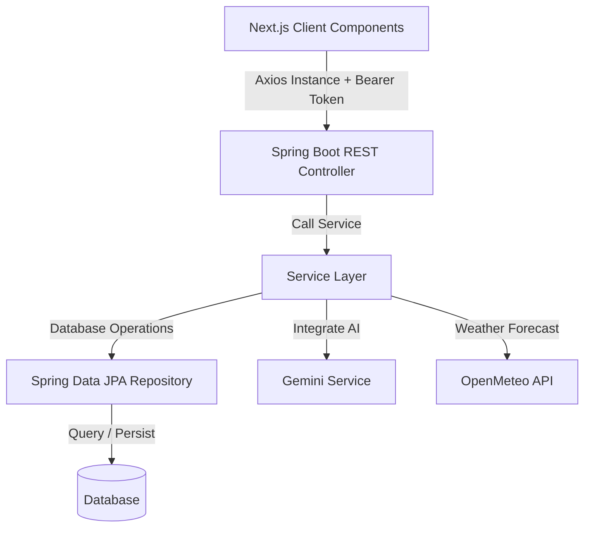

# Quy tắc & Quy chuẩn dự án VoyAI (AI Smart Travel Planner)

Tài liệu này được biên soạn bởi **Senior Developer**, đóng vai trò là bộ quy chuẩn (Guidelines) bắt buộc áp dụng cho toàn bộ quá trình phát triển dự án VoyAI (bao gồm cả Backend Spring Boot và Frontend Next.js). Tất cả thành viên dự án và AI coding assistant cần tuân thủ nghiêm ngặt các quy tắc dưới đây.

---

## 1. Tổng quan dự án (Project Overview)
*   **Tên dự án:** VoyAI / AI Smart Travel Planner.
*   **Mục tiêu:** Xây dựng nền tảng hỗ trợ người dùng lên lịch trình du lịch thông minh. Ứng dụng tích hợp Trí tuệ nhân tạo (Generative AI - Gemini) để tự động hóa việc thiết kế lịch trình chi tiết (từng ngày, các hoạt động, thời gian biểu, dự trù ngân sách và thông tin thời tiết) theo nhu cầu cá nhân hóa (điểm khởi hành, điểm đến, số ngày, ngân sách, ghi chú đặc biệt).
*   **Công nghệ cốt lõi:**
    *   **Backend:** Java 17+, Spring Boot 3.x, Spring Data JPA, Spring Security (JWT & Google OAuth2), Lombok, Gradle.
    *   **Frontend:** Next.js 16/15 (App Router), React 19, TypeScript, Tailwind CSS v4, Zustand (quản lý state), Axios (HTTP Client), Leaflet & React-Leaflet (bản đồ), `@hello-pangea/dnd` (xử lý kéo thả lịch trình).
    *   **Dịch vụ tích hợp ngoại vi:** Gemini API (AI generation), Open-Meteo API (thông tin & dự báo thời tiết), OpenStreetMap/Nominatim API (tìm kiếm & định vị tọa độ).
*   **Lưu ý bắt buộc cho AI Coding Assistant:**
    *   Trước khi sinh code mới hoặc sửa code cũ, LUÔN đọc các file liên quan đã tồn tại trong `model/`, `model/dto/`, `src/types/index.ts` để tái sử dụng đúng field/type đã có, tránh tạo trùng lặp hoặc đặt tên lệch nhau giữa Backend và Frontend.
    *   Nếu một thay đổi ở Backend (thêm/sửa/xóa field trong Entity hoặc DTO) có khả năng ảnh hưởng tới Frontend, PHẢI cập nhật đồng bộ tương ứng trong `src/types/index.ts`. Không để hai bên lệch kiểu dữ liệu.
    *   Khi không chắc chắn về một quyết định kiến trúc (ví dụ: đặt logic ở Controller hay Service, tạo DTO mới hay tái dùng DTO cũ), ưu tiên phương án tuân thủ chặt mục 4 (Architecture Patterns) hơn là phương án nhanh nhất.

---

## 2. Cấu trúc dự án (Project Structure)

### 2.1. Backend (Spring Boot) - `VoyAI_AITravelPlanner`
Cấu trúc thư mục mã nguồn chính nằm tại: `src/main/java/com/codegym/voyai`
*   `config/`: Chứa cấu hình Spring Boot (Security, CORS, JPA Auditing, AppConfig...).
*   `controller/`: REST Controllers tiếp nhận request từ Client và điều hướng nghiệp vụ.
*   `model/`: Chứa các JPA Entity chính (`Trip`, `TripDay`, `Activity`, `User`, `Role`, `BudgetEntry`, `WeatherCache`, `DestinationCost`).
    *   `dto/`: Chứa các đối tượng truyền tải dữ liệu giữa Client và Server (ví dụ: `TripRequest`, `ActivityUpdateRequest`, `ReorderRequest`...).
*   `repository/`: Các Interface tương tác với Cơ sở dữ liệu (Database).
*   `service/`: Chứa logic nghiệp vụ cốt lõi (ví dụ: `TripService`, `GeminiService`, `WeatherService`, `UserService`...).
*   `exception/`: Chứa các lớp Exception tùy chỉnh (Custom Exception) và lớp xử lý lỗi tập trung (`GlobalExceptionHandler`).

**Quy tắc tạo file mới (Backend):**
*   Entity mới → đặt trong `model/`, đặt tên danh từ số ít, không hậu tố (ví dụ: `Trip`, không phải `TripEntity`).
*   DTO mới → đặt trong `model/dto/`, đặt tên rõ mục đích nghiệp vụ bằng hậu tố `Request` (input) hoặc `Response`/`DTO` (output). Ví dụ: `ActivityCreateRequest`, `TripSummaryResponse`. Không tạo 1 DTO dùng chung cho nhiều mục đích khác nhau (ví dụ không dùng chung 1 DTO cho cả create và update nếu cấu trúc field khác nhau).
*   Exception nghiệp vụ mới (ví dụ: `TripNotFoundException`, `UnauthorizedTripAccessException`) → đặt trong `exception/`, kế thừa từ `RuntimeException`.
*   Trước khi tạo Entity/DTO mới, kiểm tra xem đã có Entity/DTO tương tự chưa để tránh trùng lặp dữ liệu.

### 2.2. Frontend (Next.js) - `AI-smart-travel-planner`
*   `app/`: Cấu trúc định tuyến (Next.js App Router).
    *   `/trips/`: Danh sách các chuyến đi.
    *   `/trips/[id]/`: Giao diện tương tác chi tiết lịch trình chuyến đi.
    *   `/login/`: Trang đăng nhập/đăng ký tích hợp Modal.
    *   `globals.css`: Thiết lập CSS toàn cục và biến cấu hình Tailwind v4.
    *   `layout.tsx`: Layout tổng thể của ứng dụng.
*   `components/`: Chứa các component giao diện chia theo module:
    *   `auth/`: Component xác thực (`login-form.tsx`, `register-form.tsx`, `profile-modal.tsx`...).
    *   `home/`: Component trang chủ (`travel-form.tsx`, `hero-slider.tsx`, `seasonal-destination-suggestions.tsx`...).
    *   `trip-details/`: Các Widget tương tác ở trang chi tiết (`ItineraryBoard.tsx`, `BudgetWidget.tsx`, `TripMap.tsx`, `WeatherWidget.tsx`, `TimelineWidget.tsx`...).
    *   `ui/`: Các component giao diện dùng chung, KHÔNG chứa business logic (Button, Dialog, Input...).
*   `src/`:
    *   `lib/`: Các cấu hình tiện ích (Axios Instance cấu hình Authorization interceptors).
    *   `services/`: Các API Service gọi lên Backend (`trip.service.ts`, `activity.service.ts`, `auth.service.ts`...).
    *   `store/`: Zustand global stores (`authStore.ts`).
    *   `types/`: Các TypeScript Interface (`index.ts`) được đồng bộ chặt chẽ với DTO & Entity của Backend.

**Quy tắc tạo file mới (Frontend):**
*   Component thuộc về 1 module nghiệp vụ cụ thể (trip-details, home, auth) PHẢI đặt trong thư mục con tương ứng. Không đặt lẫn vào `ui/`.
*   Component được đưa vào `ui/` chỉ khi nó hoàn toàn tái sử dụng được, không phụ thuộc vào nghiệp vụ Trip/Activity/Budget cụ thể nào.
*   Mỗi Service mới trong `src/services/` chỉ chịu trách nhiệm cho 1 Entity/nghiệp vụ duy nhất (ví dụ: không gộp logic gọi API của `Trip` và `Activity` vào cùng 1 file).
*   Trước khi tạo component mới, kiểm tra `components/ui/` xem đã có sẵn building block phù hợp chưa (Button, Dialog, Input...) để tái sử dụng, tránh viết lại từ đầu.

---

## 3. Tiêu chuẩn & Quy ước Code (Coding Conventions & Standards)

### 3.1. Quy ước Backend (Java/Spring Boot)
*   **Quy tắc đặt tên Repository:** Bắt buộc bắt đầu bằng chữ `I` viết hoa và kết thúc bằng `Repository` để nhận diện Interface (ví dụ: `ITripRepository`, `IActivityRepository`, `IUserRepository`).
*   **Sử dụng Lombok hiệu quả:**
    *   Sử dụng `@Data`, `@NoArgsConstructor`, `@AllArgsConstructor`, `@Builder` để tạo Boilerplate code cho Entity và DTO.
    *   Đối với quan hệ hai chiều (OneToMany/ManyToOne), luôn thêm `@ToString.Exclude` và `@EqualsAndHashCode.Exclude` trên các quan hệ để tránh lỗi vòng lặp vô hạn (Infinite Loop).
*   **Dependency Injection:** Ưu tiên sử dụng Constructor Injection thông qua `@RequiredArgsConstructor` thay vì tiêm trực tiếp bằng `@Autowired` lên thuộc tính.
*   **Xử lý ngày giờ:** Sử dụng bộ API Java 8 (`LocalDate`, `LocalTime`, `LocalDateTime`). Tránh sử dụng kiểu dữ liệu `Date` cũ. Định dạng thời gian truyền từ Client là chuỗi `"HH:mm"` hoặc `"HH:mm:ss"`.
*   **Quản lý Transaction:** Đánh dấu `@Transactional` ở tầng Service cho các tác vụ thay đổi dữ liệu hoặc cập nhật hàng loạt nhằm đảm bảo tính nhất quán (Atomicity).
*   **Validation đầu vào:** Bắt buộc dùng Jakarta Validation annotation (`@NotNull`, `@NotBlank`, `@Size`, `@Min`, `@Max`...) khai báo trực tiếp trên các trường của DTO, kết hợp `@Valid` tại tham số của method Controller. Không viết validate logic thủ công (if-else kiểm tra null/rỗng) trong Service nếu annotation đã đáp ứng được; Service chỉ validate các rule nghiệp vụ phức tạp mà annotation không xử lý được (ví dụ: kiểm tra ngày kết thúc phải sau ngày bắt đầu).
*   **Xử lý Exception tập trung:** Toàn bộ exception (cả lỗi hệ thống và lỗi nghiệp vụ tự định nghĩa trong `exception/`) phải được bắt và xử lý tại một lớp `@RestControllerAdvice` duy nhất (`GlobalExceptionHandler`). Lớp này chịu trách nhiệm map exception sang đúng HTTP Status Code và định dạng lỗi thống nhất theo mục 5.1. Tuyệt đối không dùng try-catch rải rác trong Controller chỉ để bắt lỗi và trả response — Controller không xử lý exception, chỉ để exception "ném" lên cho `GlobalExceptionHandler`.
*   **Naming method ở Service:** Theo convention thống nhất `createX`, `getXById`, `getAllXByY`, `updateX`, `deleteX` (ví dụ: `createTrip`, `getActivityById`, `updateBudgetEntry`) để các Service luôn nhất quán và dễ đoán khi đọc code.

### 3.2. Quy ước Frontend (Next.js/React/TypeScript)
*   **Kiểu dữ liệu nghiêm ngặt:** Tuyệt đối không dùng `any` bừa bãi. Sử dụng các alias type được định nghĩa sẵn ở `src/types/index.ts` để đồng bộ kiểu dữ liệu Java (ví dụ: `JavaLong`, `JavaBigDecimal`, `JavaLocalDate`).
*   **Quản lý State:**
    *   Sử dụng Zustand cho Global State (như trạng thái đăng nhập, thông tin người dùng).
    *   Sử dụng Local State (`useState`/`useRef`) cho dữ liệu chỉ liên quan đến phạm vi một Component.
*   **Quy ước Component:**
    *   Phân định rõ Client Component (`"use client"`) cho các thành phần cần sự tương tác (Forms, Drag & Drop, Map) và Server Component cho các cấu trúc tĩnh cần tối ưu SEO.
    *   Tách biệt logic gọi API vào thư mục `src/services`, component chỉ gọi service và xử lý hiển thị.
*   **Quy tắc đặt tên file & component:**
    *   Tên file component: `kebab-case.tsx` (ví dụ: `travel-form.tsx`, `budget-widget.tsx`).
    *   Tên function/component bên trong file: `PascalCase` (ví dụ: `export default function TravelForm()`).
    *   Tên hàm trong Service/Store: `camelCase`, đặt theo động từ rõ nghĩa (`fetchTripById`, `updateActivityOrder`).
*   **Quy ước gọi API (Data Fetching):**
    *   Dự án dùng **Axios thuần kết hợp `useState`/`useEffect`** (không dùng React Query/SWR). Khi cần fetch data trong component, tuân theo pattern: `useState` cho `data`, `loading`, `error` riêng biệt; gọi service trong `useEffect` với cleanup function (cờ `isMounted` hoặc `AbortController`) để tránh lỗi cập nhật state trên component đã unmount.
    *   Lỗi từ Axios được bắt và chuẩn hóa tại tầng `services/` (ví dụ: parse `error.response.data.message`), ném lại (rethrow) dưới dạng `Error` với message đã chuẩn hóa. Component KHÔNG tự ý đọc `error.response.data` trực tiếp — chỉ nhận message đã được Service xử lý sẵn để hiển thị (toast, banner lỗi...).
    *   Không gọi `axios` trực tiếp trong component hoặc trong `page.tsx`/`layout.tsx` — luôn đi qua hàm tương ứng trong `src/services/`.
*   **Styling (Tailwind CSS v4):**
    *   Dùng các utility classes chuẩn của Tailwind. Sử dụng helper `cn` (kết hợp `clsx` và `tailwind-merge`) khi cần ghép class động.
    *   Không lạm dụng CSS nội tuyến (inline style) trừ trường hợp tính toán vị trí động bằng JavaScript (ví dụ: kéo thả, vẽ timeline).

---

## 4. Mô hình kiến trúc (Architecture Patterns)

### 4.0. Nguyên tắc chung: "Controller mỏng, Service dày"
*   Controller chỉ làm 3 việc: nhận request (đã validate qua `@Valid`) → gọi đúng 1 method của Service → trả `ResponseEntity` tương ứng. Không có bất kỳ câu lệnh `if/else` xử lý nghiệp vụ, không tính toán, không gọi trực tiếp Repository hoặc API bên thứ ba trong Controller.
*   Toàn bộ nghiệp vụ, validate phức tạp, tính toán, điều phối gọi nhiều Repository/Service khác đều nằm ở tầng Service.

### 4.1. Tầng Controller
*   Đóng vai trò tiếp nhận Request, thực hiện validate dữ liệu cơ bản (nếu có) thông qua Spring Validation, điều hướng xử lý qua tầng Service và trả về Response.
*   Không viết bất kỳ logic nghiệp vụ nào trong Controller.

### 4.2. Tầng Service
*   Chứa toàn bộ logic nghiệp vụ (Business Logic). Giao tiếp với các bên thứ ba (Gemini, Open-Meteo, Nominatim) phải thông qua các Service chuyên biệt (`GeminiService`, `WeatherService`, `NominatimService`).
*   Tầng Service trả về các Entity thuần hoặc DTO sạch cho Controller, không trả về raw response của bên thứ ba.

### 4.3. Tầng Repository & Database
*   Sử dụng Spring Data JPA để tương tác dữ liệu.
*   Hạn chế tối đa việc viết Native Query trừ khi cần tối ưu hóa hiệu năng hoặc các truy vấn thống kê phức tạp. Ưu tiên sử dụng JPQL hoặc các phương thức tạo sẵn của Spring Data.

### 4.4. Tương tác bất đồng bộ & Tối ưu UI (Optimistic Updates)
*   **Vấn đề:** Các thao tác kéo thả hoạt động giữa các ngày (`ItineraryBoard`) nếu đợi API phản hồi sẽ gây trễ (lag) cho UI.
*   **Giải pháp:** Áp dụng mô hình **Optimistic Update**:
    1.  Cập nhật trạng thái hiển thị của UI ngay lập tức khi thả thẻ hoạt động.
    2.  Gửi yêu cầu Reorder lên API backend ngầm (background call).
    3.  Nếu Backend xử lý thành công, giữ nguyên trạng thái UI. Nếu thất bại, hiển thị thông báo lỗi và Rollback (khôi phục) trạng thái UI về vị trí trước khi kéo thả.

---

## 5. Phong cách phản hồi (Response Style)

### 5.1. Phản hồi API (Backend)
*   Tất cả API trả về kiểu JSON đồng bộ.
*   Sử dụng `ResponseEntity<?>` để thiết lập HTTP Status Code chuẩn chỉ:
    *   `200 OK` cho các truy vấn lấy dữ liệu hoặc cập nhật thành công.
    *   `201 Created` khi tạo mới thực thể thành công.
    *   `400 Bad Request` khi dữ liệu đầu vào không hợp lệ.
    *   `401 Unauthorized` khi token JWT hết hạn hoặc không hợp lệ.
    *   `403 Forbidden` khi người dùng không có quyền truy cập dữ liệu (ví dụ: chỉnh sửa Trip của người khác).
    *   `404 Not Found` khi không tìm thấy Resource.
*   Định dạng lỗi trả về thống nhất dạng: `{ "message": "Nội dung lỗi bằng Tiếng Việt hoặc mã lỗi hệ thống" }`.

### 5.2. Trải nghiệm người dùng (Frontend UI/UX)
*   **Thiết kế cao cấp (Premium Aesthetics):**
    *   Tông màu ấm (Orange/Amber/Warm) chủ đạo, giao diện trực quan và tạo cảm giác tươi mới, thôi thúc nhu cầu dịch chuyển (Travel).
    *   Bo góc tròn (`rounded-xl` hoặc `rounded-2xl`), hiệu ứng mờ kính (Glassmorphism), bóng đổ mềm mại (`shadow-sm` đến `shadow-lg`).
*   **Micro-animations:**
    *   Các thành phần tương tác (thẻ hoạt động, các tab ngày, button) phải có hiệu ứng chuyển động mượt mà khi hover hoặc click (sử dụng Tailwind transitions).
*   **Trạng thái chờ (Loading States):**
    *   Tuyệt đối không hiển thị màn hình trắng hoặc biểu tượng loading vòng tròn đơn giản khi AI đang dựng lịch trình.
    *   Sử dụng thanh tiến trình chạy thực tế hoặc Skeleton Screen kết hợp dòng chữ thông báo trạng thái AI đang làm gì (ví dụ: "AI đang phân tích ngân sách...", "AI đang đề xuất địa điểm ăn uống...").

### 5.3. Phong cách phản hồi của AI Coding Assistant
*   **Ngôn ngữ giải thích:** Trả lời, giải thích, tóm tắt thay đổi bằng Tiếng Việt khi giao tiếp với lập trình viên. Thuật ngữ kỹ thuật (tên class, design pattern, tên thư viện...) giữ nguyên tiếng Anh, không dịch.
*   **Comment trong code:** Viết bằng Tiếng Anh, ngắn gọn. Chỉ comment cho đoạn logic phức tạp hoặc mang tính nghiệp vụ đặc thù (ví dụ: lý do dùng `saveAll()` trong Transaction). Không comment lại những đoạn code đã tự giải thích rõ qua tên biến/hàm.
*   **Commit message:** Theo chuẩn Conventional Commits (`feat:`, `fix:`, `refactor:`, `docs:`, `chore:`...), viết ngắn gọn bằng tiếng Anh.
*   **Khi sửa code cũ:** AI phải nêu rõ những file nào bị ảnh hưởng và lý do thay đổi trước khi đưa ra diff, không tự ý sửa file ngoài phạm vi yêu cầu.

---

## 6. Quy trình làm việc (Workflows & Modes)

### 6.1. Quy trình Chuyển đổi Khách vãng lai (Guest) thành Người dùng (User)
1.  **Chế độ Khách (Guest Mode):** Người dùng chưa đăng nhập vẫn có thể tạo chuyến đi. Hệ thống sinh một `sessionId` lưu tại LocalStorage của trình duyệt và gửi kèm request tạo trip để lưu vào trường `session_id` của bảng `trips`.
2.  **Đăng ký / Đăng nhập:** Khi Guest bấm Đăng nhập/Đăng ký trên Modal và xác thực thành công.
3.  **Claim Trips Workflow:**
    *   Frontend lấy `sessionId` hiện tại từ LocalStorage.
    *   Gọi API `POST /api/trips/claim` gửi kèm `sessionId` lên Backend.
    *   Backend tìm tất cả các chuyến đi có `session_id` khớp và gán `user_id` của tài khoản vừa đăng nhập vào, sau đó xóa `session_id` của các trip đó.
    *   Frontend xóa `sessionId` khỏi LocalStorage và tải lại danh sách chuyến đi của User.

### 6.2. Quy trình kéo thả reorder Hoạt động (Drag-and-Drop)
1.  Người dùng kéo thả thẻ Hoạt động (`Activity`) từ ngày này sang ngày khác hoặc thay đổi thứ tự trong ngày.
2.  Frontend cập nhật local state của `ItineraryBoard` bằng thuật toán sắp xếp của `@hello-pangea/dnd`.
3.  Frontend tính toán lại danh sách ID hoạt động kèm `startTime` (nếu có) và gửi payload dạng `ReorderRequest` lên API: `PUT /api/activities/reorder`.
4.  Backend nhận request, kiểm tra quyền sở hữu chuyến đi của người dùng thông qua đối tượng `Authentication`, lặp qua danh sách hoạt động, cập nhật trường `sort_order` và lưu hàng loạt (`saveAll()`) trong một Transaction để tối ưu hiệu năng.

---

## 7. Quy tắc nghiệp vụ đặc thù (Module-specific Rules)

### 7.1. Module AI Planner (Tích hợp Gemini)
*   **Prompt Engineering:** Prompt gửi lên Gemini phải được cấu trúc chặt chẽ gồm điểm xuất phát, điểm đến, số ngày, tổng ngân sách, và ghi chú.
*   **Price Reference Context:** Trước khi gọi Gemini, Backend phải truy vấn bảng `DestinationCost` để lấy danh sách chi phí lịch sử của điểm đến đó và nhồi vào Prompt. Điều này giúp Gemini đưa ra đề xuất có giá trị hoạt động sát nhất với ngân sách thực tế.
*   **Định dạng phản hồi AI:** Ràng buộc Gemini trả về cấu trúc JSON nghiêm ngặt khớp với kiểu `TravelItinerary`. Nếu kết quả trả về bị lỗi cú pháp JSON hoặc sai cấu trúc, Service phải có cơ chế fallback hoặc báo lỗi rõ ràng (ném exception nghiệp vụ riêng, ví dụ `AIGenerationFailedException`) thay vì lưu dữ liệu lỗi vào DB.

### 7.2. Module Dự báo thời tiết (Weather Module)
*   **Cơ chế Cache:** Để tránh vượt quá giới hạn lượt gọi (Rate Limit) của API Open-Meteo, mọi yêu cầu lấy thời tiết phải đi qua `WeatherCache`.
*   **Quy trình kiểm tra:**
    1.  Kiểm tra trong bảng `weather_caches` xem đã có dữ liệu dự báo cho tọa độ (vĩ độ/kinh độ gần đúng) và ngày tương ứng chưa.
    2.  Nếu đã có dữ liệu, trả về cho Frontend lập tức.
    3.  Nếu chưa có, gọi API Open-Meteo để lấy dự báo thời tiết mới nhất, lưu vào bảng `weather_caches` và trả về kết quả.

### 7.3. Module Ngân sách & Chi phí (Budget Module)
*   **Tính toán động:** `budgetTotal` là tổng hạn mức người dùng thiết lập. Tổng chi tiêu thực tế được tính bằng tổng `estimatedCost` của tất cả hoạt động (`Activity`) cộng với số tiền của các khoản phát sinh ngoài lịch trình (`BudgetEntry`).
*   **Cảnh báo:** Frontend phải tính toán phần trạng sử dụng ngân sách động. Nếu chi tiêu thực tế vượt quá `budgetTotal`, hiển thị chỉ báo cảnh báo trực quan (ví dụ: chuyển thanh tiến trình từ màu cam sang màu đỏ) để cảnh báo người dùng.
*   **Đồng nhất tiền tệ:** Đảm bảo tất cả các khoản chi tiêu trong cùng một Trip phải được quy đổi hoặc tính toán theo đồng tiền cơ sở của chuyến đi (`currency`, mặc định là `VND`).

### 7.4. Module Bảo mật & Phân quyền (Security)
*   **Ownership Check bắt buộc:** Mọi API thao tác đọc/sửa/xóa trên các resource thuộc về 1 chủ thể cụ thể (`Trip`, `Activity`, `BudgetEntry`, `TripDay`) PHẢI kiểm tra `user_id` (đã đăng nhập) hoặc `session_id` (Guest) của resource đó khớp với chủ thể đang thực hiện request, thông qua đối tượng `Authentication`/`SecurityContext`. Nếu không khớp, trả về `403 Forbidden`, không trả `404` (tránh nhầm lẫn lỗi không tồn tại với lỗi không có quyền — trừ khi có lý do bảo mật riêng để che giấu sự tồn tại của resource).
*   **JWT:** Token truyền qua header `Authorization: Bearer <token>`. Endpoint public (login, register, guest trip creation, Google OAuth2 callback) phải được khai báo rõ trong `SecurityConfig` (`permitAll()`) để tránh áp dụng JWT filter nhầm.
*   **Không tin dữ liệu từ Client:** Không lấy `userId` từ body/param do Client gửi lên để xác định chủ sở hữu — luôn lấy từ `Authentication` đã được Spring Security xác thực từ token.